# Playwright Form-Filler Bot - Architecture Diagrams

## System Architecture Diagram


## Component Interaction Flow


## Data Flow Architecture


## Module Dependency Graph


## Stealth Browser Architecture


## Field Extraction Pipeline


## Autofill Decision Tree


## Error Handling Flow

```mermaid
flowchart TD
    A[User Request] --> B{Form exists in DB?}
    B -->|No| C[❌ Form not found]
    B -->|Yes| D{User exists in DB?}
    
    D -->|No| E[❌ User not found]
    D -->|Yes| F[Launch Browser]
    
    F --> G{Browser launched?}
    G -->|No| H[❌ Browser error]
    G -->|Yes| I[Navigate to URL]
    
    I --> J{Page loaded?}
    J -->|Timeout| K[❌ Page load timeout]
    J -->|Yes| L[Extract Fields]
    
    L --> M{Fields found?}
    M -->|No fields| N[Retry 10x with 1s delay]
    M -->|Yes| O[Classify with Gemini]
    
    N --> P{Retry succeeded?}
    P -->|No| Q[⚠️ No fields detected]
    P -->|Yes| O
    
    O --> R{Classification valid?}
    R -->|Parse error| S[⚠️ Empty classification]
    R -->|Success| T[Autofill Form]
    
    S --> T
    Q --> T
    
    T --> U{Autofill succeeded?}
    U -->|Partial| V[✅ Filled X fields<br/>⚠️ Some failed]
    U -->|All filled| W[✅ All fields filled]
    U -->|None| X[❌ Autofill failed]
    
    C --> Y[Send error to user]
    E --> Y
    H --> Y
    K --> Y
    V --> Z[Send success to user]
    W --> Z
    X --> Y
    
    Y --> AA[Cleanup & Exit]
    Z --> AB[Wait 5min → Close browser]
    AB --> AA
    
    style C fill:#ffcccc
    style E fill:#ffcccc
    style H fill:#ffcccc
    style K fill:#ffcccc
    style Q fill:#ffffcc
    style S fill:#ffffcc
    style V fill:#ffffcc
    style X fill:#ffcccc
    style W fill:#ccffcc
    style Z fill:#ccffcc
```



## Deployment Architecture


---

## How to View These Diagrams

### Option 1: GitHub/GitLab
- Push this file to your repository
- View on GitHub/GitLab (they render Mermaid natively)

### Option 2: VS Code Extension
- Install "Markdown Preview Mermaid Support" extension
- Open this file and click "Preview" (Ctrl+Shift+V)

### Option 3: Online Viewer
- Copy any diagram code
- Paste at: https://mermaid.live/

### Option 4: Mermaid CLI
```bash
npm install -g @mermaid-js/mermaid-cli
mmdc -i ARCHITECTURE_DIAGRAM.md -o architecture.pdf
```

---

## Diagram Descriptions

1. **System Architecture**: Complete system overview with all components and data flow
2. **Component Interaction Flow**: Detailed sequence diagram showing step-by-step execution
3. **Data Flow Architecture**: High-level data transformation pipeline
4. **Module Dependency Graph**: Shows which modules depend on which
5. **Stealth Browser Architecture**: How anti-detection is implemented
6. **Field Extraction Pipeline**: Detailed field extraction logic
7. **Autofill Decision Tree**: Logic flow for filling each field
8. **Error Handling Flow**: Complete error scenarios and recovery
9. **Deployment Architecture**: Development and runtime environment setup
