# Implementation Environment Setup Diagram

This diagram shows the complete environment setup for running the Playwright Form-Filler Bot, including dependencies, configuration, and runtime context.

```mermaid
graph TD
    subgraph "Developer Machine"
        A1[VS Code / Terminal]
        A2[Python 3.10+]
        A3[Git]
        A4[requirements.txt]
        A5[Playwright Browsers]
    end

    subgraph "Configuration Files"
        B1[.env<br/>Secrets]
        B2[forms.json<br/>Form Database]
        B3[users.json<br/>User Database]
    end

    subgraph "Python Modules"
        C1[main.py]
        C2[config.py]
        C3[browser_utils.py]
        C4[form_extractor.py]
        C5[field_classifier.py]
        C6[form_filler.py]
    end

    subgraph "External Services"
        D1[Telegram Bot API]
        D2[Google Gemini API]
        D3[Target Websites]
    end

    A1 --> A2
    A1 --> A3
    A1 --> A4
    A1 --> A5
    A2 -->|pip install -r| A4
    A2 -->|playwright install| A5
    A2 --> C1
    A2 --> C2
    A2 --> C3
    A2 --> C4
    A2 --> C5
    A2 --> C6
    A3 -->|git clone/pull| C1
    A3 -->|git clone/pull| C2
    A3 -->|git clone/pull| C3
    A3 -->|git clone/pull| C4
    A3 -->|git clone/pull| C5
    A3 -->|git clone/pull| C6
    C1 --> B1
    C1 --> B2
    C1 --> B3
    C1 --> D1
    C5 --> D2
    C3 --> D3
    C4 --> D3
    C6 --> D3

    style A1 fill:#ffd700,stroke:#333,stroke-width:2px,color:#000
    style A2 fill:#ffd700,stroke:#333,stroke-width:2px,color:#000
    style A3 fill:#ffd700,stroke:#333,stroke-width:2px,color:#000
    style A4 fill:#ffd700,stroke:#333,stroke-width:2px,color:#000
    style A5 fill:#ffd700,stroke:#333,stroke-width:2px,color:#000
    style B1 fill:#87ceeb,stroke:#333,stroke-width:2px,color:#000
    style B2 fill:#87ceeb,stroke:#333,stroke-width:2px,color:#000
    style B3 fill:#87ceeb,stroke:#333,stroke-width:2px,color:#000
    style C1 fill:#4ecdc4,stroke:#333,stroke-width:2px,color:#000
    style C2 fill:#4ecdc4,stroke:#333,stroke-width:2px,color:#000
    style C3 fill:#4ecdc4,stroke:#333,stroke-width:2px,color:#000
    style C4 fill:#4ecdc4,stroke:#333,stroke-width:2px,color:#000
    style C5 fill:#4ecdc4,stroke:#333,stroke-width:2px,color:#000
    style C6 fill:#4ecdc4,stroke:#333,stroke-width:2px,color:#000
    style D1 fill:#ff6b6b,stroke:#333,stroke-width:2px,color:#fff
    style D2 fill:#ff6b6b,stroke:#333,stroke-width:2px,color:#fff
    style D3 fill:#ff6b6b,stroke:#333,stroke-width:2px,color:#fff
```

---

**How to View:**
- Use VS Code with Mermaid preview, GitHub, or https://mermaid.live/
- This diagram shows all setup steps, dependencies, and external services for implementation.
